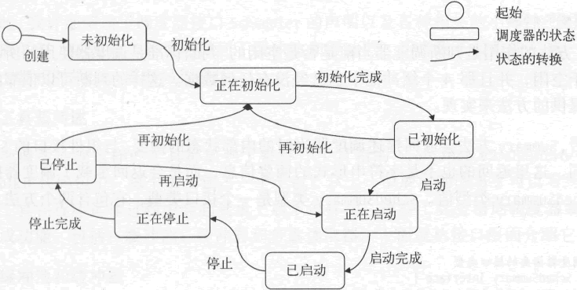

<center><h1>网络爬虫的接口设计</h1></center>

---

这里所说的接口是指网络爬虫框架中各个模块的接口。与先前描述的基本数据结构不同，它们的主要职责是定义模块的行为。在定义行为的过程中，我会对它们应有的功能作进一步的审视，同时也会更多地思考它们之间的协作方式。

下面就开始逐一设计网络爬虫框架中的这类接口，以及相关的其他类型。为了更易于理解，先从那几个处理模块的接口开始，然后再去考虑怎样定义调度器以及它会用到的各种工具的行为。

### 下载器

下载器的功能就是从网络中的目标服务器上下载内容。内容在网络中的唯一标识是网络地址，但是它只能起到定位的作用，并不是成功下载内容的充分条件。

HTTP 协议是基于 TCP/IP 协议栈的应用层协议，它是互联网世界的根基之一。因此，互联网时代诞生的绝大多数语言都会使用不同的方式提供针对该协议的 API。当然，Go语言也不例外。Go 的标准库代码包 net/http 就提供了这类 API。

在编写网络爬虫框架的基本数据结构时，就用过其中的两个类型：http.Request 和 http.Response。实际上，我们将要构建的网络爬虫框架就是以 HTTP 协议和 net/http 代码包中的 API 为基础的。

从下载器充当的角色来讲，它的功能只有两个：发送请求和接收响应。因此，我可以设计出这样一个方法声明：

```go
//用于根据请求获取内容并返回响应
Download(req *Request) (*Response, error)
```

Download 的签名完全体现出了下载器应有的功能。但是作为处理模块，下载器还应该拥有一些方法以供统计、描述之用。不过正因为这些方法是所有处理模块都应具备的，所以要编写一个更加抽象的接口类型。请看下面的声明：

```go
//Module代表组件的基础接口类型。
//该接口的实现类型必须是并发安全的
type Module interface {
    //用于获取当前组件的ID
    ID() MID
    //用于获取当前组件的网络地址的字符串形式
    Addr() string
    //用于荻取当前组件的评分
    Score() uint64
    //用于设置当前组件的评分
    SetScore(score uint64)
    //用于获取评分计算器
    ScoreCalculator() CalculateScore
    //用于获取当前组件被调用的计数
    CalledCount() uint64
    //用于获取当前组件接受的调用的计数，
    //组件一般会由于超负荷或参数有误而拒绝调用
    AcceptedCount() uint64
    //用于获取当前组件已成功完成的调用的计数
    CompletedCount() uint64
    //用于获取当前组件正在处理的调用的数量
    HandlingNumber() uint64
    //用于一次性获取所有计数
    Counts() Counts
    //用于获取组件摘要
    Summary() SummaryStruet
}
```

处理模块之所以又称为组件，是因为它们实现的都是扩展功能，可组装到网络爬虫框架上。但同时它们又是重要的，因为如果没有它们，就无法使用这个框架编写出一个可以运转起来的网络爬虫。

Module 接口定义了组件的基本行为。其中，MID 是 string 的别名类型，它的值一般由 3 部分组成：标识组件类型的字母、代表生成顺序的序列号和用于定位组件的网络地址。网络地址是可选的，因为组件实例可以和网络爬虫的主程序处于同一个进程中。下面的模版声明可以很好地说明 MID 类型值的构成：

```go
//组件ID的模板
var midTemplate = "%s%d|%s"
```

说到标识组件类型的字母，就要先介绍一下组件的类型。请看下面的声明：

```go
//组件的类型
type Type string
//当前认可的组件类型的常量
const (
    //下载器
    TYPE_DOWNLOADER Type = "downloader"
    //分析器
    TYPE_ANALYZER Type = "analyzer"
    //棗目处理管道
    TYPE_PIPELINE Type = "pipeline"
)
```

组件类型常量的值已经直白地表达了其含义。基于此，我可以明确它们与字母之间的对应关系：

```go
//合法的组件类型-字母的映射
var legalTypeLetterMap = map[Type]string{
    TYPE_DOWNLOADER: "D",
    TYPE_ANALYZER:    "A",
    TYPE_PIPELINE:    "P",
}
```

组件 ID 中的序列号可以由网络爬虫框架的使用方提供。这就需要我们在框架内提供一个工具，以便于统一序列号的生成和获取。序列号原则上是不能重复的，也是顺序给出的。但是如果序列号超出了给定范围，就可以循环使用。据此，我编写了一个序列号生成器的接口类型：

```go
//序列号生成器的接口类型
type SNGenertor interface {
    //用于获取预设的最小序列号
    Start() uint64
    //用于获取预设的最大序列号
    Max() uint64
    //用于获取下一个序列号
    Next() uint64
    //用于获取循环计数
    CycleCount() uint64
    //用于获得一个序列号并准备下一个序列号
    Get() uint64
}
```

其中最小序列号和最大序列号都可以由使用方在初始化序列号生成器时给定。循环计数代表了生成器生成的序列号在前两者指定的范围内循环的次数。

网络地址在 MID 中的格式是 "< IP >:< port >"，例如 "127.0.0.1:8080"，这类字符串其实就是 Module 接口的 Addr 方法返回的。

下图展示和总结了组件 ID 的构成及生成方法。

<div align=center> 
     
    <p>图：组件 ID 的构成及生成方法</p>
</div>

Module 接口中的第 3 个至第 5 个方法是关于组件评分的，这又涉及组件注册方面的设计。按照我的设想，在网络爬虫程序真正启动之前，应该先向组件注册器注册足够的组件实例。只有如此，程序才能正常运转。组件注册器可以注册、注销以及获取某类组件的实例，并且还可以清空所有组件实例。所以，它的接口类型这样声明：

```go
//组件注册器的接口
type Regisinterface {
    //用于注册组件实例
    Register(module Module) (bool, error)
    //用于注销组件实例
    Unregister(mid MID) (bool, error)
    //用于获取一个指定类型的组件的实例，
    //该函数基于负载均衡策略返回实例
    Get(moduleType Type) (Module, error)
    //用于获取指定类型的所有组件实例
    GetAllByType(moduleType Type) (map[MID]Module, error)
    //用于获取所有组件实例
    GetAll() map[MID]Module
    //清除所有的组件注册记录
    Clear()
}
```

这个接口的 Get 方法用于获取一个特定类型的组件实例，它实现某种负载均衡策略，使得同一类型的多个组件实例有相对平均的机会作为结果返回。这里所说的负载均衡策略就是基于组件评分的。组件评分可以通过 Module 接口定义的 Score 方法获得。相对地，SetScore 方法用于设置评分。这个评分的计算方法抽象为名为 CalculateScore 的函数类型，其声明如下：

```go
//用于计算组件评分的函数类型
type CalculateScore func(counts Counts) uint64
```

其参数类型 Counts 是一个结构体类型，包含了代表组件相关计数的字段。通过 Module 接口定义的 ScoreCalculator 方法，可以获得当前组件实例使用的评分计算器。Module 接口之所以没有包含设置评分计算器的方法，是因为评分计算器在初始化组件实例时给定，并且之后不能变更。

组件实例的评分的获取、设置及其计算方法完全由它自己实现（或者由网络爬虫框架的使用方自行确定），所以调度器以及网络爬虫框架无须插手评分的具体过程，仅仅确定评分的制度就好了。

再回到 Module 接口的声明，其中第 6 个至第 10 个方法用于获取各种计数，并且第 10 个方法的结果的类型就是 Counts。这就形成了一个闭环，让组件的评分机制在接口层面变得完整。

Module 接口中的最后一个方法 Summary，用于获取组件实例的摘要信息。注意，这个摘要信息并不是字符串形式的，而是 SummaryStruct 类型的。这种结构化的摘要信息对于控制模块和监控工具都更加友好，同时也有助于组装和嵌入。SummaryStruct 类型的声明是这样的：

```go
//组件摘要结构的类型
type SummaryStruct struct {
    ID  MID  'json:"id"'
    Called  uint64  'json:"called"'
    Accepted  uint64  'json:"accepted"'
    Completed uint64  'json:"completed"'
    Handling  uint64  'json:"handling"'
    Extra  interface{} 'json:"extra,omitempty"'
}
```

如果你使用过标准库中的 encoding/json 包的话，就一定知道这个类型的值可以序列化为 JSON 格式的字符串。实际上，网络爬虫框架中的所有摘要类信息都是如此。当今主流的日志收集系统大都可以宜接解析 JSON 格式的日志文本。

另外，你可以顺便注意一下 SummaryStruct 类型中的 Extra 字段，该字段的作用是为额外的组件信息的纳入提供支持。

讲完了 Module 接口的声明以及相关的各种类型定义和设计理念，让我们再回过头去接着设计下载器的接口。有了上述的一系列铺垫，组件实例的基本结构和方法以及对它们的管理规则都已经比较明确了。下载器的接口声明反而变得简单了，如下所示：

```go
// Downloader代表下载器的接口类型。
// 该接口的实现类型必须是并发安全的
type Downloader interface {
    Module
    //根据请求获取内容并返回响应
    Download(req *Request) (*Response, error)
}
```

可以看到，Downloader 接口中仅仅包含了一个 Module 接口的嵌入和前面提到的那个 Download 方法。

### 分析器

分析器的职责是根据给定的规则分析响应，下面就是其接口类型的声明：

```go
// Analyzer代表分析器的接口类型。
// 该接口的实现类型必须是并发安全的
type Analyzer interface {
    Module
    //用于返回当前分析器使用的响应解析函数的列表
    RespParsers() []ParseResponse
    //根据规则分析响应并返回请求和条目，
    //响应需要分别经过若干响应解析函数的处理，然后合并结果
    Analyze(resp *Response) ([]Data, []error)
}
```

Analyzer 接口与下载器的接口一样，都嵌入了 Module 接口，并且都声明了一个简单明了的方法用于执行属于自己的任务。这里多出的 RespParsers 方法用于获取分析器示例使用的响应解析器（也称 HTTP 响应解析函数），它的结果类型是元素类型为 ParseResponse 的切片类型。

ParseResponse 是一个函数类型，它的声明如下：

```go
//用于解析 http 响应的函数的类型
type ParseResponse func(httpResp *http.Response, respDepth uint32) ([]Data, []error)
```

声明这样一个函数类型的意义在于让网络爬虫框架的使用者可以自定义响应的分析过程，以及生成相应的请求和条目的方式。该函数类型的参数 httpResp 表示目标服务器返回的 HTTP 响应，而参数 respDepth 则代表了该响应的深度。

我实际上把整个响应分析、筛选和结果生成的过程都寄托于使用者提供的 ParseResponse 函数类型的实现。而在 Analyze 方法的实现中，我只想把若干个此类 HTTP 响应解析函数的结果合并起来返回而已。

这里体现了多层定制接口的设计理念。第一层接口就是 Downloader、Analyzer 这类，你可以完全实现自己的下载器和分析器。第二层就是诸如 ParseResponse 的函数类型。如果你想使用框架提供的默认组件实现，就可以只编写这类函数，这同样也可以达到高度定制的目的。

### 条目处理管道

条目处理管道的功能就是为条目的处理提供环境，并控制整体的处理流程，具体的处理步骤由网络爬虫框架的使用者提供。实现单一处理步骤的程序称为条目处理器。它的类型同样由单一的函数类型代表，所以也可以称为条目处理函数。这又会是一组双层定制接口，下面我们来看看相关的类型声明：

```go
// Pipeline 代表条目处理管道的接口类型。
// 该接口的实现类型必须是并发安全的
type Pipeline interface {
    Module
    //用于返回当前条目处理管道使用的条目处理函数的列表
    ItemProcessors() []ProcessItem
    // Send 会向条目处理管道发送条目
    //条目需要依次经过若干条目处理函数的处理
    Send(item Item) []error
    // FailFast 方法会返回一个布尔值，该值表示当前条目处理管道是否是快速失败的。
    //这里的快速失败是指：只要在处理某个条目时在某一个步骤上出错，
    //那么条目处理管道就会忽略掉后续的所有处理步骤并报告错误
    FailFast() bool
    //设置是否快速失败
    SetFailFast(failFast bool)
}
//用于处理条目的函数的类型
type ProcessItem func(item Item) (result Item, err error)
```

Pipeline 接口中最重要的方法就是 Send 方法，该方法使条目处理管道的使用方可以向它发送条目，以使其中的条目处理器（也称条目处理函数）对这些条目进行处理。

FailFast 方法和 SetFailFast 对应于条目处理管道的“快速失败”特性。方法的注释对这一特性已有清晰的描述。至于 ItemProcessors 方法，我就不多说了。

函数类型 Processitem 接受一个需要处理的条目，并把处理后的条目和可能发生的错误作为结果值返回。如果第二个结果值不为 nil，就说明在这个处理过程中发生了一个错误。

最后，一定要注意，与下载器和分析器一样，条目处理管道的实现也一定要是并发安全的。也就是说，它们的任何方法在同时调用时都不能产生竞态条件。这主要是因为调度器会在任何需要的时候从组件注册器中获取一个组件实例并使用。

同一个组件实例可能会用来并发处理多个数据。组件实例不能成为调度器执行并发调度的阻碍。此外，与之有关的各种计数和摘要信息的读写操作同样要求组件本身具有并发安全性。

### 调度器

调度器属于控制模块而非处理模块，它需要对各个处理模块的运作进行调度和控制。可以说，调度器是网络爬虫框架的心脏。因此，我需要由它来启动和停止爬取流程。另外，出于监控整个爬取流程的目的，还应该在这里提供获取实时状态和摘要信息的方法。

依照这样的思路，我们编写了这样一个接口类型声明：

```go
//调度器的接口类型
type Scheduler interface {
    // Init用于初始化调度器。
    //参数requestArgs代表请求相关的参数。
    //参数dataArgs代表数据相关的参数。
    //参数moduleArgs代表组件相关的参数
    Init(requestArgs RequestArgs,
        dataArgs DataArgs,
        moduleArgs ModuleArgs) (err error)
    // Start用于启动调度器并执行爬取流程
    //参数firstHTTPReq代表首次请求，调度器会以此为起始点开始执行爬取流程
    Start(firstHTTPReq *http.Request) (err error)
    //Stop用于停止调度器的运行
    //所有处理模块执行的流程都会被中止
    Stop() (err error)
    //用于获取调度器的状态
    Status() Status
    // ErrorChan用于获得错误通道。
    //调度器以及各个处理模块运行过程中出现的所有错误都会被发送到该通道。
    //若结果值为nil，则说明错误通道不可用或调度器已停止
    ErrorChan() <-chan error
    //用于判断所有处理模块是否都处于空闲状态
    Idle() bool
    //用于获取摘要实例
    Summary() SchedSummary
}
```

Scheduler 接口类型的声明及相关代码都放在 gopcp.v2/chapter6/webcrawler/scheduler 代码包中。

Scheduler 接口的 Init 方法用于调度器的初始化。初始化调度器需要一些参数，这些参数分为 3 类：请求相关参数、数据相关参数和组件相关参数。这 3 类参数分别封装在了 RequestArgs、DataArgs 和 ModuleArgs 类型中。RequestArgs 类型的声明如下：

```go
//请求相关的参数容器的类型
type RequestAigs struet {
    // AcceptedDomains 代表可以接受的 URL 的主域名的列表。
    // URL 主域名不在列表中的请求都会被忽略
    AcceptedDomains []string 'json:"accepted_primary_domains"'
    // MaxDepth 代表需要爬取的最大深度。
    //实际深度大于此值的请求都会被忽略
    MaxDepth uint32 'json:"max_depth"'
}
```

该类型中的两个字段都是用来定义爬取范围的。AcceptedDomains 用于指定可以接受的 HTTP 请求的 URL，用其主域名作为限定条件。因为几乎没有一个非个人的网站不存在指向其他网站的链接。

所以，如果不加以控制，随着爬取深度的增加，爬取范围会不断地急剧扩大。这对于网络爬虫程序可能会是一个灾难。导致的结果就是，新的爬取目标越来越多，爬取过程总也无法结束。所以，我们一定要在爬取广度方面有所约束。

而最大爬取深度则是另外一方面的约束，我在前面已经描述过它的计算方法。有了这两个方面的约束，我们就为爬取明确了一个范围，爬取的目标不会也不应该超岀这个范围。

DataArgs 类型中包括的是与数据缓冲池相关的字段，这些字段的值用于初始化对应的数据缓冲池。调度器使用这些数据缓冲池传递数据。具体来说，调度器使用的数据缓冲池有 4 个——请求缓冲池、响应缓冲池、条目缓冲池和错误缓冲池，它们分别用来传输请求类型、响应类型、条目类型和 error 类型的数据。

根据我对缓冲池的接口类型的定义（至此还未讲过），每个缓冲池需要两个参数，包括：缓冲池中单一缓冲器的容量，以及缓冲池包含的缓冲器的最大数量。这样算来，DataArgs 类型中字段的总数就是 8，下面是该类型的声明：

```go
//数据相关的参数容器的类型
type DataArgs struct {
    //请求缓冲器的容量
    ReqBufferCap uint32 'json:":req_buffer_cap"'
    //请求缓冲器的最大数量
    ReqMaxBufferNumber uint32 'json:"req_max_buffer_number"'
    //响应缓冲器的容量
    RespBufferCap uint32 'json:":resp_buffer_cap"'
    //响应缓冲器的最大数量
    RespMaxBufferNumber uint32 'json:"resp_max_buffer_number"'
    //条目缓冲器的容量
    ItemBufferCap uint32 'json:"item_buffer_cap"'
    //条目缓冲器的最大数量
    ItemMaxBufferNumber uint32 'json:"item_max_buffer_number"'
    //错误缓冲器的容量
    ErrorBufferCap uint32 'json:"error_buffer_cap"'
    //错误缓冲器的最大数量
    ErrorMaxBufferNumber uint32 'json:"error_max_buffer_number"'
}
```

关于缓冲池和缓冲器的接口定义，后面会专门介绍，这里只需要知道一个缓冲池会包含若干个缓冲器，两者都实现了并发安全的、队列式的数据传输功能，但前者是可伸缩的。

ModuleArgs 类型的参数是最重要的，它可以提供 3 种组件的实例列表，其结构如下：

```go
//组件相关的撰数容器的类型
type ModuleArgs struct {
    //下载器列表
    Downloaders []module.Downloader
    //分析器列表
    Analyzers []module.Analyzer
    //条目处理管道管道列表
    Pipelines []module.Pipeline
}
```

有了这些参数，网络爬虫程序就可以正常启动了。不过，拿到这些参数时，需要做的第一件事就必须是检查它们的有效性。为了让这类参数容器必须提供检查的方法，我编写了一个接口类型，并让上述 3 个类型都实现它：

```go
//参数容器的接口类型
type Args interface {
    // Check 用于自检参数的有效性。
    //若结果值为nil,则说明未发现问题，否则就意味着自检未通过
    Check() error
}
```

对于 RequestArg 类型的值来说，若 AcceptedDomains 字段的值为 nil，就说明参数无效。对于 DataArgs 类型的值来说，任何字段的值都不能为 0。而对于 ModuleArgs 类型的值来说，3 种组件的实例都必须至少提供一个。

Scheduler 接口的实现实例需要通过上述这些参数正确设置自己的状态，并为启动做好准备。一旦初始化成功，就可以调用它的 Start 方法以启动调度器。Start 方法只接受一个参数——首次请求。一旦满足了这最后一个必要条件，调度器就可以按照既定流程运转起来了。

Scheduler 接口的 Stop 方法可以停止调度器的运行。调度器的启动和停止都可能失败。更具体地说，如果代表错误的方法的结果值不为 nil，就说明调用没有成功。对于启动来说，失败的原因可能是有无效的参数，也可能是调度器当时的状态不能启动。

对于停止来说，状态不对应该是唯一的失败原因。因为停止的方式是向调度器内部和各个组件异步发出停止信号，所以即使有什么问题，也不会反映在 Stop 方法的结果值上。

Scheduler 接口的 Status 方法用于获取调度器当时的状态。它的返回结果是 Status 类型的，该类型是一个 uint8 类型的别名类型。调度器的状态值会被限定在一个很有限的范围内。下面通过一系列常量来表示这一范围：

```go
const (
    //未初始化的状态
    SCHED_STATUS_UNINITIALIZED Status = 0
    //正在初始花的状态
    SCHED_STATUS_INITIALIZING Status = 1
    //已初始化焉状态
    SCHED_STATUS_INITIALIZED Status = 2
    //正在启动岛状态
    SCHED_STATUS_STARTING Status = 3
    //已启动的状态
    SCHED_STATUS_STARTED Status = 4
    //正在停止的状态
    SCHED_STATUS_STOPPING Status = 5
    //已停止的状态
    SCHED_STATUS_STOPPED Status = 6
)
```

调度器在状态转换方面需要有一套规则，具体如下。

- 当调度器处于正在初始化、正在启动或正在停止状态时，不能由外部触发状态的变化。也就是说，这时的调度器不能被初始化、启动或停止。
- 处于未初始化状态时，调度器不能被启动或停止。理所应当，没有必要的参数设置，调度器是无法运作的。
- 处于已启动状态时，调度器不能被初始化或启动。调度器是可以被再初始化的，但是必须在未启动的情况下才能这样做。另外，调用运行中的调度器的 Start 方法是不会成功的。
- 仅当调度器处于已启动状态时，才能被停止。换句话说，对不在运行中的调度器调用 Stop 方法肯定会失败。

纵观这些规则可以看出，调度器的初始化、启动和停止是需要按照次序进行的。只有已初始化的调度器才能被启动，只有已启动的调度器才能被停止。另一方面，允许重新初始化操作使得调度器可被复用。

调度器处于未初始化、已初始化或已停状态时，都可以重新初始化。下图展示了调度器的状态转换。

<div align=center> 
     
    <p>图：调度器的状态转换</p>
</div>

Scheduler 接口中声明的最后 3 个方法 ErrorChan、Idle 和 Summary 都是用于获取调度器的运行状况的。调度器一旦启动，它的内部状态会随具体情况不断变化。对于调度器的使用方来说，只能也只应该通过这 3 个方法获取其运行状况。

ErrorChan 方法用于获得错误通道。注意，其结果类型是 ＜-chan error，一个只允许接收操作的单向通道类型。调度器会把运行期间发生的绝大部分错误都封装成错误值并放入这个错误通道。调度器的使用方在启动它之后立即调用 ErrorChan 方法并不断地尝试从其结果值中获取错误值，就像这样：

```go
//省略部分代码
sched := NewScheduler()
err := sched.Init(requestArgs, dmtaArgs, moduleArgs)
if err != nil {
    logger.Fatalf("An error occurs when initializing scheduler: %s", err)
}
err = sched.Start(firstHTTPReq)
if err != nil {
    logger.Fatalf("An error occurs when starting scheduler: %s", err)
}
//观察错误
go func() {
    errChan := sched.ErrorChan()
    for {
        err, ok := <-errChan
        if !ok {
            break
        }
        logger.Errorf("An error occurs when :running schedule: %s", err)
    }
}()
//省略部分代码
```

Idle 方法的作用是判断调度器当前是否是空闲的。判断标准是调度器使用的所有组件都正处于空闲，并且那 4 个缓冲池中也已经没有任何数据。这样的判断可以依靠组件和缓冲池提供的方法来实现。

最后，Summary 方法会返回描述调度器当时的内部状态的摘要。与组件接口的 Summary 方法相同，这里返回的也不是字符串形式的摘要信息，而是会返回承载了调度器摘要信息的 SchedSummary 类型值。SchedSummary 类型是一个接口类型，它包含两个方法，如下所示：

```go
//调度器摘要的接口类型
type SchedSummary interface {
    //用于获得摘要信息的结构化形式
    Struet() SummaryStruct
    //用于获得摘要信息的字符串形式
    String() string
}
```

该类型的值本身并不是摘要，但可以用两种方式输出摘要。结构化的摘要信息可供调度器的使用方再加工，而字符串形式的摘要信息可供直接打印。该接口中的 Struct 方法会返回 SummaryStruct 类型的值。它与组件接口 Module 的 Summary 方法的结果类型同名，但却不是同一个类型，也不在同一个代码包内。我们是这样声明这里的 SummaryStruct 类型的：

```go
//表示调度器摘要的结构
type SummaryStruct struct {
    RequestArgs  RequestArgs 'json:"dequest_args"'
    DataArgs  DataArgs  'json:"data_args"'
    ModuleArgs  ModuleArgsSummary  'json:"module_args"'
    Status  string  'json:"status"'
    Downloaders  []module.SummaryStruct  'json:"downloaders"
    Analyzers  []module.SummmiyStnict  'json:"analyzers"'
    Pipelines  []module.SummaryStruct  'json:"pipelines"'
    ReqBufferPool BufferPoolSummaryStruct 'json:"request_buffer_pool"'
    RespBufferPool BufferPoolSummaryStruet 'json:":response_buffer_pool"'
    ItemBufferPool BufferPoolSummaryStruet 'json:"item_buffer_pool"'
    ErrorBufferPool BufferPoolSummaryStruct 'json:"error_buffer_pool"'
    NumURL  uint64  'json:"url_number"'
}
```

从其中字段的命名和类型上，你就可以猜出它们的含义。它们用于描述调度器接受的参数、调度器的状态，及其使用的各个组件和缓冲池的状态等。理想情况下，调度器的使用方定时收集这样的摘要，并在必要时予以展现。

顺便提一下，调用包级私有函数 newSchedSummary 可以创建一个 SchedSummary 类型值，只要你传给它必要的参数值。

至此，我详细阐述了调度器接口 Scheduler 的声明以及各种相关的小部件（包括参数、状态、摘要等）的设计，并且还提到了缓冲池和缓冲器。后者属于较重的工具，在设计和实现上都相对烦琐，需要另行描述。

### 工具箱简述

我们把像缓冲池这样的工具都放到了被称作工具箱的 src/gopcp.v2/chapter6/webcra-wler/toolkit 代码包中，每个工具独占一个子包。工具箱中的工具在程序运作过程中会起到承上启下的作用，这些工具会帮助调度器或组件更好地完成功能，包括：缓冲池、缓冲器和多重读取器。

### 缓冲池和缓冲器

缓冲池和缓冲器是一对程序实体。缓冲器是缓冲池的底层支持，缓冲池是缓冲器的再封装。缓冲池利用它持有的缓冲器实现数据存取的功能，并可以根据情况自动增减它持有的缓冲器的数量。下面先来看缓冲池的接口声明：

```go
//数据缓冲池的接口类型
type Pool interface {
    //用于获取池中缓冲器的统一容量
    BufferCap() uint32
    //用于获取池中缓冲器的最大数量
    MaxBufferNumber() uint32
    //用于获取池中缓冲器的数量
    BufferNumber() uint32
    //用于获取缓冲池中数据的总数
    Total() uint64
    // Put用于向缓冲池放入数据。
    //注意！本方法是阻寒的。
    //若缓冲池已关闭，则会直接返回非 nil 的错误值
    Put(datum interface{}) error
    // Get用于从缓冲池获取数据。
    //注意！本方法是阻塞的。
    //若缓冲池已关闭，则会直接返回非nil的错误值
    Get() (datum interface{}, err error)
    // Close用于关闭缓冲池。
    //若缓冲池之前已关闭则返回false,否则返回true
    Close() bool
    //用于判断缓冲池是否已关闭
    Closed() bool
}
```

前面讲调度器的数据相关参数时，提到过缓冲池中单一缓冲器的容量和缓冲池包含的缓冲器的最大数量。Pool 接口中的 BufferCap 和 MaxBufferNumber 方法分别用于获得这两个数值。

实际上，调度器在拿到 DataArgs 类型的参数值并确认有效之后，就会用其中字段的值去初始化对应的缓冲池。缓冲池会在内部记录下这两个参数值，并在存取数据的时候使用它们。

BufferNumber 方法用于获取缓冲池实例在当下实际持有的缓冲器的数量，这个数量总会大于等于 1 且小于等于上述的缓冲器最大数量。

Total 方法用于获取缓冲池实例在当下实际持有的数据的总数，这个总数总会小于等于单一缓冲器容量和缓冲器最大数量的乘积。

Put 方法和 Get 方法需要实现缓冲池最核心的功能——数据的存入和读岀。对于这样的操作，在缓冲池关闭之后是不成功的。这时总是返回非 nil 的错误值。另外，这两个方法都是阻塞的。当缓冲池已满时，对 Put 方法的调用会产生阻塞。当缓冲池已空时，对 Get 方法的调用会产生阻塞。这遵从通道类型的行为模式。

最后，Close 方法会关闭当前的缓冲池实例。如果后者已关闭，就会返回 false，否则返回 true。Closed 方法用于判断当前的缓冲池实例是否已关闭。

如果缓冲池只持有固定数量的缓冲器，那么它的实现会变得非常简单，基本上只利用缓冲器的方法实现功能就可以了。不过这样的话，再封装一层就没什么意义了。缓冲池这一层的核心功能恰恰就是动态伸缩。

对于一个固定容量的缓冲来说，缓冲器可以完全胜任，用不着缓冲池。并且，缓冲器只需做到这种程度。这样可以足够简单。更高级的功能全部留给像缓冲池那样的高层类型去做。缓冲器的接口是这样的：

```go
// FIFO的缓冲器的接口类型
type Buffer interface {
    //用于获取本缓冲器的容量
    Cap() uint32
    //用于获取本缓冲器中数据的数量
    Len() uint32
    // Put用于向缓冲器放入数据。
    //注意！本方法是非阻寒的。
    //若缓冲器已关闭，则会直接返回非nil的错误值
    Put(datum interface{}) (bool, error)
    // Get用于从缓冲器获取器。
    //注意！本方法是非阻塞的。
    //若缓冲器已关闭，则会直接返回非nil的错误值
    Get() (interface{}, error)
    // Close用于关闭缓冲器。
    //若缓冲器之前已关闭，则返回false,否则返回true
    Close() bool
    //用于判断缓冲器是否已关闭
    Closed() bool
}
```

Cap 方法和 Len 方法分别用于获取当前缓冲器实例的容量和长度。容量代表可以容纳的数据的最大数量，而长度则代表当前容纳的数据的实际数量。

注意，这里的 Put 和 Get 方法与缓冲池的对应方法在行为上有一点不同，即前者是非阻塞的。当缓冲器已满时，Put 方法的第一个结果值就会是 false。当缓冲器已空时，Get 方法的第一个结果值一定会是 nil。这样做也是为了让缓冲器的实现保持足够简单。

你可能会有一个疑问，缓冲器的功能看似用通道类型就可以满足，为什么还要再造一个类型出来呢？在讲通道类型的时候，强调过两个会引发运行时恐慌的操作：向一个已关闭的通道发送值和关闭一个已关闭的通道。

实际上，缓冲器接口及其实现就是为了解决这两个问题而存在的。在 Put 方法中，我会先检查当前缓冲器实例是否已关闭，并且保证只有在检查结果是否的时候才进行存入操作。在 Close 方法中，我仅会在当前缓冲器实例未关闭的情况下进行关闭操作。

另外，我们无法知道一个通道是否已关闭。这也是导致上述第二个引发运行时恐慌的情况发生的最关键的原因。有了 Closed 方法，我们就可以知道缓冲器的关闭状态，问题也就迎刃而解了。

缓冲池和缓冲器的诞生都是为了扩展通道类型的功能，其实我梦想中的通道类型就是这个样子。

### 多重读取器

如果你知道 io.Reader 接口并且使用过它的实现类型 (bytes.Reader、bufio.Reader 等) 的话，就肯定会知道通过这类读取器只能读取一遍它们持有的底层数据。当读完底层数据时，它们的 Read 方法总会把 io.EOF 变量的值作为错误值返回。

另外，如果你使用 net/http 包中的程序实体编写过 Web 程序的话，还应该知道 http.Response 类型的 Body 字段是 io.ReadCloser 接口类型的，而且该接口的类型声明中嵌入了 io.Reader 接口。

前者只是比后者多声明了一个名为 Close 的方法。相同的是，当 HTTP 响应从远程服务器返回并封装成 * http.Response 类型的值后，你只能通过它的 Body 字段的值读取 HTTP 响应体。

这种特性本身没有什么问题，但是在我对分析器的设计中，这样的读取器会造成一些小麻烦。还记得吗？一个分析器实例可以持有多个响应解析函数。由于 Body 字段值的上述特性，如果第一个函数通过它读取了 HTTP 响应体，那么之后的函数就再也读不到这个 HTTP 响应体了。响应解析函数一个很重要的职责就是分析 HTTP 响应体并从中筛选出可用的部分。所以，如此一来，后面的函数就无法实现主要的功能了。

你也许会想到，分析器可以先读出 HTTP 响应体并赋给一个 []byte 类型的变量，然后把它作为参数直接传给多个响应解析函数。这是可行的，但是我认为这样做会让代码变得丑陋，因为这个值在内容方面与 ParseResponse 函数类型的第一个参数有所重叠。更为关键的是，这会改变 ParseResponse 函数类型的声明，这并不值得。

我们的做法是，设计一个可以多次提供基于同一底层数据（可以是 []byte 类型的）的 io.ReadCloser 类型值的类型。我把这个类型命名为 MultipleReader，意为多重读取器，它的接口声明很简单：

```go
//多重读取器的接口
type MultipleReader interface {
    // Reader用于获取一个可关闭读取器的实例。
    //后者会持有该多重读取器中的数据
    Reader() io.ReadCloser
}
```

在创建这个类型的值时，我们可以把 HTTP 响应的 Body 字段的值作为参数传入。作为产出，我们可以通过它的 Reader 方法多次获取基于同一个 HTTP 响应体的读取器。

这些读取器除了基于同一底层数据之外毫不相干。这样一来，我们就可以让多个响应解析函数中的分析筛选操作完全独立、互不影响了。

之所以让这个 Reader 方法返回 io.ReadCloser 类型的值，是因为我们要用这个值替换 HTTP 响应原有的 Body 字段值，这样做是为了让这一改进对响应解析函数透明。也就是说，不让响应解析函数感知到分析器中所作的改变。

多重读取器的接口相当简单（它的实现类型同样简单），但确实解决掉了一个痛点。