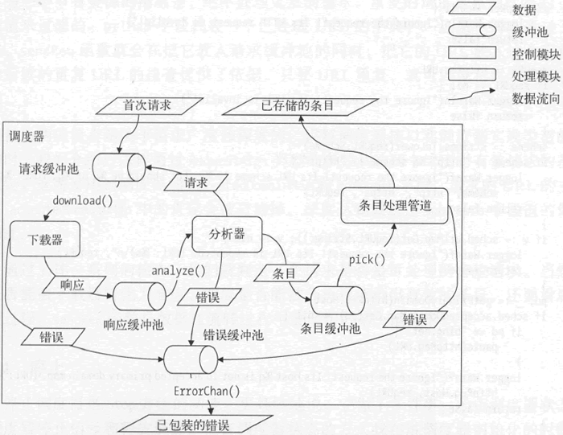

<center><h1>网络爬虫调度器的实现</h1></center>

---

Go语言网络爬虫调度器的实现

### 基本结构

依据调度器的职责及其接口声明，可以编写出调度器实现类型的基本结构，这个基本结构中的字段比较多，这里先把它们展示出来，然后再逐一说明：

```go
//调度器的实现类型
type myScheduler struet {
    //爬取的最大深度，首次请求的深度为0
    maxDepth uint32
    //可以接受的URL的主域名的字典
    acceptedDomainMap cmap.ConcurrentMap
    //组件注册器
    registrar module.Registrar
    //请求的缓冲池
    reqBufferPool buffer.Pool
    //响应的缓冲池
    respBufferPool buffer.Pool
    //条目的缓冲池
    itemBufferPool buffer.Pool
    //错误的缓冲池
    errorBufferPool buffer.Pool
    //已处理的URL的字典
    urlMap cmap.ConcurrentMap
    //上下文，用于感知调度器的停止
    ctx context.Context
    //取消函数，用于停止调度器
    cancelFunc context.CancelFunc
    //状态
    status Status
    //专用于状态的读写锁
    statusLock sync.RWMutex
    //摘要信息
    summary SchedSummary
}
```

下面简要介绍各个字段的含义。

字段 maxDepth 和 acceptedDomainMap 分别用于限定爬取目标的深度和广度。在分析器解析出新的请求后，我会用它们逐一过滤那些请求，不符合要求的请求会直接扔掉。这两个字段的值会从 RequestArgs 类型的参数值中提取。

registrar 字段代表组件注册器。如前文所述，其值可由 module 包的 NewRegistrar 函数直接生成。需要注册到该组件注册器的所有组件实例都由 ModuleArgs 类型的参数值提供。

字段 reqBufferPool、respBufferPool、itemBufferPool 和 errorBufferPool 分别代表针对请求、响应、条目和错误的缓冲池。前面讲调度器接口时介绍过 DataArgs 类型，也提到过这 4 个缓冲池。

初始化它们所需的参数自然要从一个 DataArgs 类型的参数值中得到。调度器使用这些缓冲池在各类组件实例之间传递数据。也正因为如此，调度器才能让数据真正流转起来，各个组件实例才能发挥岀应有的作用。

urlMap 字段的类型是 cmap.ConcurrentMap。还记得我们在第5章最后编写的那个并发安全字典吗？它的代码就在 gopcp.v2/chapter5/cmap 代码包中。由于 urlMap 字段存在的目的是防止对同一个 URL 的重复处理，并且必会并发地操作它，所以把它声明为 cmap.ConcurrentMap 类型再合适不过。在后面，你会看到调度器对它的简单使用。

ctx 字段和 cancelFunc 字段是一对。两者都是由同一个 context.Context 类型值生成出来的。cancelFunc 字段代表的取消函数用于让所有关注 ctx 并会调用其 Done 方法的代码都感知到调度器的停止。

status 字段是 Status 类型的。关于 Status 类型以及调度器状态的转换规则，前面讲调度器接口时已经详细说明过。而 statusLock 字段则代表专门为调度器状态的转换保驾护航的读写锁。

summary 字段是为存储调度器摘要而准备的。与调度器接口中的 Summary 方法的结果一样，它的类型是 SchedSummary，该类型的值可提供两种格式的摘要信息输岀。

虽然上述字段大都需要显式赋值，但是用于创建调度器实例的 NewScheduler 函数仍然非常简单：

```go
//创建调度器实例
func NewScheduler() Scheduler {
    return &myScheduler{}
}
```

一切初始化调度器的工作都交给 Init 方法去做。

### 初始化

调度器接口中声明的第一个方法就是 Init 方法，它的功能是初始化当前调度器。

关于 Init 方法接受的那 3 个参数，前面已经提到多次。Init 方法会对它们进行检查。不过在这之前，它必须先检查调度器的当前状态，请看下面的代码片段：

```go
func (sched *myScheduler) Init(
    requestArgs RequestArgs,
    dataArgs DataArgs,
    moduleArgs ModuleArgs) (err error) {
    //检查状态
    logger.Info("Check status for initialization...")
    var oldStatus Status
    oldStatus, err = sched.checkAndSetStatus(SCHED_STATUS_INITIALIZING)
    if err != nil {
        return
    }
    defer func() {
        sched.statusLock.Lock()
        if err 1= nil {
            sched.status = oldStatus
        } else {
            sched.status = SCHED_STATUS_INITIALIZED
        }
        sched.statusLock.Unlock()
    }()
    //省略部分代码
}
```

这里有对状态的两次检查。第一次是在开始处，用于确认当前调度器的状态允许我们对它进行初始化，这次检查由调度器的 checkAndSetStatus 方法执行。该方法会在检查通过后按照我们的意愿设置调度器的状态（这里是“正在初始化”状态），它的声明如下:

```go
//用于状态检查，并在条件满足时设置.状态
func (sched *myScheduler) checkAndSetStatus(
    wantedStatus Status) (oldStatus Status, err error) {
    sched.statusLock.Lock()
    defer sched.statusLock.Unlock()
    oldStatus = sched.status
    err = checkStatus(oldStatus, wantedStatus, nil)
    if err == nil {
        sched.status = wantedStatus
    }
    return
}
```

下面是其中调用的 checkStatus 方法声明的片段：

```go
// checkStatus 用于状态检查。
// 参数 currentStatus 代表当前状态。
// 参数 wantedStatus 代表想要的状态。
// 检查规则：
//    1.处于正在初始化、正在启动或正在停止状态时，不能从外部改变状态。
//    2.想要的状态只能是正在初始化、正在启动或正在停止状态中的一个。
//    3.处于未初始化状态时，不能变为正在启动或正在停止状态。
//    4.处于已启动状态时，不能变为正在初始化或正在启动状态。
//    5.只要未处于已启动状态，就不能变为正在停止状态
func checkStatus(
    currentStatus Status,
    wantedStatus Status,
    lock sync.Locker) (err error) {
    //省略部分代码
}
```

这个方法的注释详细描述了检查规则，这决定了调度器是否能够从当前状态转换到我们想要的状态。只要欲进行的转换违反了这些规则中的某一条，该方法就会直接返回一个可以说明状况的错误值，而 checkAndSetStatus 方法会检查 checkStatus 方法返回的这个错误值。只有当该值为 nil 时，它才会对调度器状态进行设置。

Init 方法对调度器状态的第二次检查是通过 defer 语句实施的。在该方法执行结束时，它会检查初始化是否成功完成。如果成功，就会把调度器状态设置为“已初始化”状态，否则就会让状态恢复原状。

实际上，在调度器实现类型的 Start 方法和 Stop 方法的开始处，也都有类似的代码，它们共同保证了调度器的动作与状态之间的协同。

如果当前状态允许初始化，那么 Init 方法就会开始做参数检查。这并不麻烦，因为那 3 个参数的类型本身都提供了检查自身的方法 Check。相关代码如下：

```go
func (sched *myScheduler) Init(
    requestArgs RequestArgs,
    dataArgs DataArgs,
    moduleArgs ModuleArgs) (err error) {
    //省略部分代码
    //检查参数
    logger.Info("Check request arguments...")
    if err = requestArgs.Check(); err != nil {
        return err
    }
    logger.Info("Check data arguments...")
    if err = dataArgs.Check(); err != nil {
        return err
    }
    logger.Info("Data arguments are valid.")
    logger.Info("Check module arguments...")
    if err = moduleArgs.Check(); err != nil {
        return err
    }
    logger.Info("Module arguments are valid.")
    //省略部分代码
}
```

在这之后，Init 方法就要初始化调度器内部的字段了。关于这些字段的初始化方法，之前都陆续讲过，这里就不再展示了。最后，我们来看一下用于组件实例注册的代码：

```go
func (sched *myScheduler) Init(
    requestArgs RequestArgs,
    dataArgs DataArgs,
    moduleArgs ModuleArgs) (err error) {
    //省略部分代码
    //注册组件
    logger.Info("Register modules...")
    if err = sched.registerModules(moduleArgs); err != nil {
        return err
    }
    logger.Info("Scheduler has been initialized.")
    return nil
}
```

在 registerModules 方法中，利用已初始化的调度器的 registrar 字段注册使用方提供的所有组件实例，并在发现任何问题时直接返回错误值。Init 方法也是类似的，只要在初始化过程中发现问题，就忽略掉后面的步骤并把错误值返回给使用方。

综上所述，Init 方法做了 4 件事：检查调度器状态、检查参数、初始化内部字段以及注册组件实例。一旦这 4 件事都做完，调度器就为启动做好了准备。

### 启动

调度器接口中用于启动调度器的方法是 Start。它只接受一个参数，这个参数是 *http.Request 类型的，代表调度器在当次启动时需要处理的第一个基于 HTTP/HTTPS 协议的请求。

Start 方法首先要做的是防止启动过程中发生运行时恐慌。其次，它还需要检查调度器的状态和使用方提供的参数值，并把首次请求的主域名添加到可接受的主域名的字典。因此，它的第一个代码片段如下：

```go
func (sched *myScheduler) Start(firstHTTPReq *http.Request) (err error) {
    defer func() {
        if p := recover(); p != nil {
            errMsg := fmt.Sprintf("Fatal scheduler error: %sched", p)
            logger.Fatal(errMsg)
            err = genError(errMsg)
        }
    }()
    logger.Info("Start scheduler...")
    //检查状态
    logger.Info("Check status for start...")
    var oldStatus Status oldStatus, err =
        sched.checkAndSetStatus(SCHED_STATUS_STARTING)
    defer func() {
        sched.statusLock.Lock()
        if err != nil {
            sched.status = oldStatus
        } else {
            sched.status = SCHED_STATUS_STARTED
        }
        sched.statusLock.Unlock()
    }()
    if err != nil {
        return
    }
    //检查参数
    logger.Info("Check first HTTP request...")
    if firstHTTPReq == nil {
        err = genParameterError("nil first HTTP request")
        return
    }
    logger.Info("The first HTTP request is valid.")
    //获得首次请求的主域名，并将其添加到可接受的主域名的字典
    logger.Info("Get the primary domain...")
    logger.Infof("-- Host: %s", firstHTTPReq.Host)
    var primaryDomain string
    primaryDomain, err = getPrimaryDomain(firstHTTPReq.Host)
    if err != nil {
        return
    }
    logger.Infof("-- Primary domain: %s", primaryDomain)
    sched.acceptedDomainMap.Put(primaryDomain, struet{}{})
    //省略部分代码
}
```

可以把 Start 方法和 Init 方法中检查调度器状态的代码对照起来看，并想象这是一个状态机在运转。

把首次请求的主域名添加到可接受主域名字典的原因是，网络爬虫程序最起码会爬取首次请求指向的那个网站中的内容。如果不添加这个主域名，那么所有请求（包括首次请求）都不会被调度器受理。Start 方法至此已经做好了准备，可以真正启动调度器了：

```go
func (sched *myScheduler) Start(firstHTTPReq *http.Request) (err error) {
    //省略部分代码
    //开始调度数据和组件
    if err = sched.checkBufferPoolForStart(); err != nil {
        return
    }
    sched.download()
    sched.analyze()
    sched.pick()
    logger.Info("Scheduler has been started.")
    //放入第一个请求
    firstReq := module.NewRequest(firstHTTPReq, 0)
    sched.sendReq(firstReq)
    return nil
}
```

把激活各类组件和各类缓冲池的代码分别封装到了调度器的 download、analyze 和 pick 方法中。依次调用这些方法后，通过 sendReq 方法把首次请求发给了请求缓冲池。一旦发送成功，调度器就会运转起来。这些激活的操作以及调度器的运转都是异步的。Start 方法在启动调度器之后，就会立即返回。

以上就是 Start 方法的总体执行流程，下面我们详细介绍几个重要的内部方法。

#### 1) 处理请求

处理请求需要下载器和请求缓冲池，下面先从调度器的 download 方法看起：

```go
//从请求缓冲池取出请求并下载，然后把得到的响应放入响应缓冲池
func (sched *myScheduler) download() {
    go func() {
        for {
            if sched.canceled() {
                break
            }
            datum, err := sched.reqBufferPool.Get()
            if err != nil {
                logger.Warnln("The request buffer pool was closed. Break request reception.")
                break
            }
            req, ok := datum.(*module.Request)
            if !ok {
                errMsg := fmt.Sprintf("incorrect request type: %T", datum)
                sendError(errors.New(errMsg), "", sched.errorBufferPool)
            }
            sched.downloadOne(req)
        }
    }()
}
```

在 download 方法中，新启用了一个 goroutine。在对应的 go 函数中，先通过对 canceled 方法的调用感知调度器的停止。只要发现调度器已停止，download 方法（更确切地说是其中的却函数）就会中止流程执行。canceled 方法的代码如下：

```go
//用于判断调度器的上下文是否已取消
func (sched *myScheduler) canceled() bool {
    select {
        case <- sched.ctx.Done():
            return true
        default:
            return false
    }
}
```

该方法感知调度器停止的手段实际上就是调用 ctx 字段的 Done 方法。回顾一下，这个方法会返回一个通道。一旦那个由 cancelFunc 字段代表的函数被调用，该通道就会关闭，试图从该通道接收值的操作就会立即结束。

回到 download 方法。在 for 语句的开始处，download 方法会从 reqBufferPool 获取一个请求。如果 reqBufferPool 已关闭，这时就会得到一个非 nil 的错误值，这说明在 download 方法获取请求时调度器关闭了。这同样会让流程中止。

在各方并发运行的情况下，这种情况是可能发生的，甚至发生概率还很高。注意，从 reqBufferPool 获取到的请求是 interface{} 类型的，必须先做一下数据类型转换。

万一它的数据类型不对，download 方法就会调用 sendError 函数向 errorBufferPool 字段代表的错误缓冲池发送一个说明此情况的错误值。虽然正常情况下不应该发生这种数据类型的错误，但还是顺便做一下容错处理比较好。

之所以有 sendError 这个方法，是因为在真正向错误缓冲池发送错误值之前还需要对错误值做进一步加工。请看该方法的声明：

```go
//用于向错谋缓冲池发送错误值
func sendError(err error, mid module.MID, errorBufferPool buffer.Pool) bool {
    if err == nil || errorBufferPool == nil || errorBufferPool.Closed() {
        return false
    }
    var crawlerError errors.CrawlerError
    var ok bool
    crawlerError, ok = err.(errors.CrawlerError)
    if !ok {
        var moduleType module.Type
        var errorType errors.ErrorType
        ok, moduleType = module.GetType(mid)
        if !ok {
            errorType = errors.ERROR_TYPE_SCHEDULER
        } else {
            switch moduleType {
                case module.TYPE_DOWNLOADER:
                    errorType = errors.ERROR_TYPE_DOWNLOADER
                case module.TYPE_ANALYZER:
                    errorType = errors.ERROR_TYPE_ANALYZER
                case module.TYPE_PIPELINE:
                    errorType = errors.ERROR_TYPE_PIPELINE
            }
        }
        crawlerError = errors.NewCrawlerError(errorType, err.Error())
    }
    if errorBufferPool.Closed() {
        return false
    }
    go func(crawlerError errors .CrawlerEiro］：) {
        if err := errorBufferPool.Put(crawlerError); err != nil {
            logger.Warnln("The error buffer pool was closed. Ignore error sending.")
        }
    }(crawlerError)
    return true
}
```

在确保参数无误的情况下，sendError 函数会先判断参数 err 的实际类型。如果它不是 errors.CrawlerError 类型的，就需要对它进行加工。sendError 函数依据参数 mid 判断它代表的组件的类型，并以此确定错误类型。

如果判断不出组件类型，就会认为这个错误是调度器抛出来的，并设定错误类型为 errors.ERROR_TYPE_SCHEDULER。从另一个角度讲，如果传给 sendError 函数的错误是由某个组件实例引起的，就把该组件实例的 ID 一同传给该方法，这样 sendError 函数就能正确包装这个错误，从而让它有更明确的错误信息。当然，如果这个错误是由调度器给出的，就只需像 download 方法那样把 "" 作为 sendError 函数的第二个参数值传入。

正确包装错误只是成功的一半。即使包装完成，错误缓冲池关闭了也是枉然。另外请注意 sendError 函数后面的那条 go 语句。依据我之前的设计，调度器的 ErrorChan 方法用于获得错误通道。

调度器的使用方应该在启动调度器之后立即调用 ErrorChan 方法并不断地尝试从其结果值中获取错误值。实际上，这里错误通道中的错误值就是从错误缓冲池那里获得的。那么问题来了，如果使用方不按照上述方式做，那么一旦发生大量错误，错误通道以及错误缓冲池就会很快填满，进而调用 sendError 函数的一方就会被阻塞。别忘了，缓冲池的 Put 方法是阻塞的。

所以，上面那条 go 语句的作用就是：即使调度器的使用方不按规矩办事，爬取流程也不会因此停滞。当然，这并不是说不按规矩办事没有代价，运行中 goroutine 的大量增加会让 Go 运行时系统的负担加重，网络爬虫程序的运行也会趋于缓慢。

再回到 download 方法。处理单个请求的代码都在 downloadOne 方法中，download 方法在 for 语句的最后调用了这个方法。downloadOne 方法的代码如下：

```go
//根据给定的请求执行下载并把响应放入响应缓冲池
func (sched *myScheduler) downloadOne(req *module.Request) {
    if req == nil {
        return
    }
    if sched.canceled() {
        return
    }
    m, err := sched.registrar.Get(module.TYPE_DOWNLOADER)
    if err != nil || m == nil {
        errMsg := fmt.Sprintf("couldn't get a downloader: %s", err)
        sendError(errors.New(errMsg), "", sched.errorBufferPool)
        sched.sendReq(req)
        return
    }
    downloader, ok := m.(module.Downloader)
    if !ok {
        errMsg := fmt.Sprintf("incorrect downloader type: %T (MID: %s)", m, m.ID())
        sendError(errors.New(errMsg), m.ID(), sched.errorBufferPool)
        sched.sendReq(req)
        return
    }
    resp, err := downloader.Download(req)
    if resp != nil {
        sendResp(resp, sched.respBufferPool)
    }
    if err != nil {
        sendError(err, m.ID(), sched.errorBufferPool)
    }
}
```

可以看到，该方法也会在一开始就去感知调度器的停止，这是这些内部方法必做的事情。downloadOne 方法会试图从调度器持有的组件注册器中获取一个下载器。如果获取失败，就没必要去做后面的事情了。如果获取成功，该方法就会去检查并转换下载器的类型，然后把请求作为参数传给下载器的 download 方法，最后获得结果并根据实际情况向响应缓冲池或错误缓冲池发送数据。

注意，一旦下载器获取失败或者下载器的类型不正确，downloadOne 方法就会把请求再放回请求缓冲池。这也是为了避免因局部错误而导致的请求遗失。

sendResp 函数在执行流程上与 sendError 函数很类似，甚至还要简单一些：

```go
//用于向响应缓冲池发送响应
func sendResp(resp *module.Response, respBufferPool buffer.Pool) bool {
    if resp == nil || respBufferPool == nil || respBufferPool.Closed() {
        return false
    }
    go func(resp *module.Response) {
        if err := respBufferPool.Put(resp); err != nil {
            logger.Warnln("The response buffer pool was closed. Ignore response sending.")
        }
    }(resp)
    return true
}
```

它会在确认参数无误后，启用一个 goroutine 并把响应放入响应缓冲池。

调度器的 download 方法只负责不断地获得请求，而 downloadOne 方法则负责获得一个下载器，并让它处理某个请求。这两个方法的分工还是比较明确的。稍后会讲的处理响应和处理条目的流程其实都与之类似。

在编写程序的时候，我们可以让实现类似功能的代码呈现近似甚至一致的总体流程和基本结构。注意，这与编写重复的代码是两码事，而是说在更高的层面上让代码更有规律。如此一来，阅读代码的成本就会低很多，别人可以更容易地理解你的意图和程序逻辑。在编写网络爬虫框架的时候，一直在有意识地这么做。

#### 2) 处理响应

处理响应需要分析器和响应缓冲池，具体的代码在 analyze 和 analyzeOne 方法中。analyze 方法看起来与 download 方法很相似，只不过它处理的是响应，使用的是响应缓冲池，调用的是 analyzeOne 方法。相关代码如下：

```go
//用于从响应集冲池取出响应并解析，热后把将■到的条目或请求放入相应的缓冲池
func (sched *myScheduler) analyze() {
    go func() {
        for {
            if sched.canceled() {
                break
            }
            datum, err := sched.respBufferPool.Get()
            if err != nil {
                logger.Warnln("The response buffer pool was closed. Break response reception.")
                break
            }
            resp, ok := datum.(*module.Response)
            if !ok {
                errMsg := fmt.Sprintf("incorrect response type: %T", datum)
                sendError(errors.New(errMsg), "", sched.errorBufferPool)
            }
            sched.analyzeOne(resp)
        }
    }()
}
```

与 downloadOne 方法相比，analyzeOne 方法除了操纵的对象不同，还要多做一些事情：

```go
//根据给定的响应执行解析并把结果放入相应的缓冲池
func (sched *myScheduler) analyzeOne(resp *module.Response) {
    if resp == nil {
        return
    }
    if sched.canceled() {
        return
    }
    m, err := sched.registrar.Get(module.TYPE_ANALYZER)
    if err != nil || m == nil {
        errMsg := fmt.Sprintf("couldn't get an analyzer: %s", err)
        sendError(errors.New(errMsg), "", sched.errorBufferPool)
        sendResp(resp, sched.respBufferPool)
        return
    }
    analyzer, ok := m.(module.Analyzer)
    if !ok {
        errMsg := fmt.Sprintf("incorrect analyzer type: %T (MID: %s)",
            m, m.ID())
        sendError(errors.New(errMsg), m.ID(), sched.errorBufferPool)
        sendResp(resp,sched.respBufferPool)
        return
    }
    dataList, errs := analyzer.Analyze(resp)
    if dataList != nil {
        for _, data := range dataList {
            if data == nil {
                continue
            }
            switch d := data.(type) {
            case *module.Request:
                sched.sendReq(d)
            case module.Item:
                sendItem(d, sched.itemBufferPool)
            default:
                errMsg := fmt.Sprintf("Unsupported data type %T! (data: %#v)", d, d)
                sendError(errors.New(errMsg), m.ID(), sched.errorBufferPool)
            }
        }
    }
    if errs != nil {
        for _, err := range errs {
            sendError(err, m.ID(), sched.errorBufferPool)
        }
    }
}
```

分析器的 Analyze 方法在处理某个响应之后会返回两个结果值：数据列表和错误列表。其中，数据列表中的每个元素既可能是新请求也可能是新条目。analyzeOne 方法需要 对它们进行类型判断，以便把它们放到对应的数据缓冲池中。对于错误列表，analyzeOne 方法也要进行遍历并逐一处理其中的错误值。

#### 3) 处理条目

处理条目需使用条目处理管道，同时也要用到条目缓冲池。调度器的 pick 和 pickOne 方法承载了相关的代码。pick 方法同样与 download 方法很相似，pickOne 方法的实现比 downloadOne 方法还要稍微简单一些，因为条目处理管道的 Send 方法在对条目进行处理之后只返回错误列表。

#### 4) 数据、组件和缓冲池

纵观调度器对它持有的数据、组件和缓冲池的调动方式，我们可以画出一张更加详细的数据流程图，如下所示。

<div align=center> 
     
    <p>图：更详细的数据流程图</p>
</div>

从上图中可以看到，各类数据在各个组件和缓冲池之间的流转方式，以及调度器的一些重要方法在其中起到的作用。

#### 5) 发送请求

前面多次展现过调度器的方法 sendReq，该方法的功能是向请求缓冲池发送请求。与之前讲过的 sendError 函数和 sendResp 函数不同，它会对请求实施很严格的检查和过滤。一旦发现请求不满足某个条件，就立即返回 false。其实现代码如下：

```go
// sendReq会向请求缓冲池发送请求。
//不符合要求的请求会被过滤掉
func (sched *myScheduler) sendReq(req *module.Request) bool {
    if req == nil {
        return false
    }
    if sched.canceled() {
        return false
    }
    httpReq := req.HTTPReq()
    if httpReq == nil {
        logger.Warnln("Ignore the request! Its HTTP request is invalid!")
        return false
    }
    reqURL := httpReq.URL
    if reqURL == nil {
        logger.Warnln("Ignore the request! Its URL is invalid!")
        return false
    }
    scheme := strings.ToLower(reqURL.Scheme)
    if scheme != "http" && scheme != "https" {
        logger.Warnf("Ignore the request! Its URL scheme is %q, but should be %q or %q. (URL: %s)\n", scheme, "http", "https", reqURL)
        return false
    }
    if v := sched.urlMap.Get(reqURL.String()); v != nil {
        logger.Warnf("Ignore the request! Its URL is repeated. (URL: %s)\n", reqURL)
        return false
    }
    pd, _ := getPrimaryDomain(httpReq.Host)
    if sched.acceptedDomainMap.Get(pd) == nil {
        if pd == "bing.net" {
            panic(httpReq.URL)
        }
        logger.Warnf("Ignore the request! Its host %q is not in accepted primary domain map.(URL: %s)\n", httpReq.Host, reqURL)
        return false
    }
    if req.Depth() > sched.maxDepth {
        logger.Warnf("Ignore the request! Its depth %d is greater than %d.(URL: %s)\n", req.Depth(), sched.maxDepth, reqURL)
        return false
    }
    go func(req *module.Request) {
        if err := sched.reqBufferPool.Put(req); err != nil {
            logger.Warnln("The request buffer pool was closed. Ignore request sending.")
        }
    }(req)
    sched.urlMap.Put(reqURL.String(), struct{}{})
    return true
}
```

诸如请求是否为 nil、请求中代表 HTTP 请求的字段值是否为 nil、HTTP 请求中代表 URL 的字段值是否为 nil 都是最基本的检查。

大家应该已经知道，本章描述的网络爬虫框架是基于 HTTP/HTTPS 协议的，它只能从网络中获取可通过 HTTP/HTTPS 协议访问的内容。因此，检查请求 URL 的 scheme 是必需的。否则，即使把不符合该条件的请求放入缓冲池，也肯定得不到正确的处理，白白浪费了资源。

另一个节省资源的措施是，绝不处理重复的请求。重复的请求是靠调度器的 urlMap 字段值来过滤的。urlMap 字段代表一个已处理 URL 的字典。一旦某个请求通过了所有检查，sendReq 函数就会在把它放入请求缓冲池的同时，把它的 URL 放入这个字典，这就为后续的重复 URL 的检查提供了依据。只要 URL 重复，就可以说它代表的请求是重复的。

最后两项检查是关于请求广度和深度的，讲解调度器接口和调度器实现类型的基本结构时，我们介绍过怎样通过 RequestArgs 类型的参数从这两个维度对有效请求的范围进行限定。这需要用到调度器的 acceptedDomainMap 和 maxDepth 字段。请求的 URL 的主域名不在 acceptedDomainMap 中的肯定会被过滤掉，深度达到或超过 maxDepth 字段值的请求也是如此。

通过上述一系列的检查，我们就判定一个请求是否是可处理的有效请求。当然，请求是否能被下载器转化为响应、响应是否能被分析器解析出有效的条目，还要看后续的处理过程。sendReq 函数是数据在流转过程中要经历的第一道关卡。

### 停止

停止调度器是 Stop 方法的功能。更具体地说，它做了 3 件事：检查调度器状态、发出调度器停止信号和释放资源。检查调度器状态的方式我在讲调度器初始化的时候详细阐述过。发出调度器停止信号的时候，需要用到调度器的 cancelFunc 字段。一旦该字段代表的函数被调用，调度器中的各个部分就会感知到并停止运行。

纵观调度器实现类型中的所有字段，那 4 个缓冲池算是比较重量级的了，主要是因为它们都包装了若干个通道。在停止调度器时，我们应该及时关闭它们。关闭方式很简单，调用它们的 Close 方法即可。另外，我们没有必要再去重置其他字段的值。调度器重新启动的时候，还会用到它们。

### 其他方法

除了前文所述的 Init、Start 和 Stop 方法外，调度器接口级别的方法还有 Status、ErrorChan、Idle 和 Summary。后者全是用于获取调度器运行状况的方法，其中最值得一提的就是 ErrorChan 方法。

已知，代表错误缓冲池的 errorBufferPool 字段用于暂存调度器运行过程中发生的错误。虽然我们可以直接从错误缓冲池那里获取错误值，但是 ErrorChan 方法的结果类型却是 ＜-chan error。

这么做的原因是，我无法对外部使用错误缓冲池的方式进行限制。任何得到错误缓冲池的人都可以随意调用其接口级别的方法，尤其是 Put 方法。而通道就不同了，只要结果类型是 ＜-chan error，调用 ErrorChan 方法的一方就只能接收值而不能发送值，这可以从根本上消除一个可能影响调度器运行的隐患。

下面我们来看看 ErrorChan 方法是怎样进行从错误缓冲池到错误通道的转换的：

```go
func (sched *myScheduler) ErrorChan() ＜-chan error {
    errBuffer := sched.errorBufferPool
    errCh := make(chan error, errBuffer.BufferCap())
    go func(errBuffer buffer.Pool, errCh chan error) {
        for {
            if sched.canceled() {
                close(errCh)
                break
            }
            datum, err := errBuffer.Get()
            if err != nil {
                logger.Warnln("The error buffer pool was closed. Break error reception.")
                close(errCh)
                break
            }
            err, ok := datum.(error)
            if !ok {
                errMsg := fmt.Sprintf("incorrect error type: %T", datum) sendError(errors.New(errMsg), "", sched.errorBufferPool)
                continue
            }
            if sched.canceled() {
                close(errCh)
                break
            }
            errCh <- err
        }
    }(errBuffer, errCh)
    return errCh
}
```

该方法在创建了一个错误通道后，就立即专门启用一个 goroutine 去做错误值的搬运工作。然后，直接返回新创建的错误通道。除非发现调度器已关闭，这个 go 函数会一直尝试从错误缓冲池获得错误值，并在检查通过后把它发送给错误通道。一旦发现调度器已关闭，该函数就会立即关闭错误通道。这为 ErrorChan 方法的调用方感知调度器的关闭提供了支持。

注意，与调度器中专用于向缓冲池放入数据的方法一样，这里的 go 函数也不会直接使用任何外部值，所有的外部值均通过参数传入，这主要是为了防止外部值失效。

最后，再简单说一下 Idle 方法。之前讲调度器接口时已经说过判断调度器空闲的条件。判断所有组件实例是否已空闲的方法是，通过调度器持有的组件注册器的 GetAll 方法拿到所有已注册的组件实例，然后逐一调用它们的 HandlingNumber 方法。只要该方法的结果值大于 0，就说明调度器不是空闲的。

另外，还需要检查除错误缓冲池之外的所有缓冲池中的数据总数，只要有缓冲池存有数据，也说明调度器没有空闲。为什么不检查错误缓冲池？不要指望调度器的使用方会像你预期的那样调用 ErrorChan 方法并及时取走错误值。不过别担心，即使关闭了调度器，使用方照样可以从 ErrorChan 方法的结果值那里取走所有已存在的错误值。

### 总结

调度器实现类型 myScheduler 及其方法，合理运用它持有的缓冲池在各个组件实例之间搬运数据，同时有效地操控所有已注册的组件实例及时地转换数据，最后得到使用方想要的结果。使用方通过提供自定义的条目处理函数生成最终结果，并通过提供自定义的 HTTP 响应解析函数生成新的请求和条目。

当然，使用方也可以提供完全自定义的下载器、分析器和条目处理管道。但是，不论怎样，调度器实现类型都会采取快速失败的策略去检查所有参数，并在运行过程中保证不会因这些自定义组件和函数的异常行为造 成调度器崩溃。

从自身角度讲，调度器程序的运行效率主要取决于各种缓冲池的容量和各类组件实例的处理速度。所以，在初始化调度器时，总应该仔细斟酌传入的那些参数。当然，对 goroutine 的适当使用也让调度器程序在拥有多核 CPU 的计算机中可以展示出更高的效能。同时，这也使调度器程序的功能实现了完全的异步化。

另外，调度器程序自身是并发安全的。为了提供并发安全性，我们直接或间接地用到了通道 (channel)，读写锁 (sync.RWMutex)、原子操作 (sync/atomic)、上下文 (context.Context) 以及并发安全字典 (gopcp.v2/chapter5/cmap.ConcurrentMap) 等。不过，这也要得益于并发安全的各类组件的默认实现。在实现自己的组件类型时，一定要注意它们的并发安全性。

以调度器为核心的网络爬虫框架是为了方便我们编写网络爬虫程序而存在的，它本身只提供基础层面的各种支持，而没有实现高层次的功能。后者与你关注的爬取目标、制定的爬取策略以及想要的爬取结果息息相关。