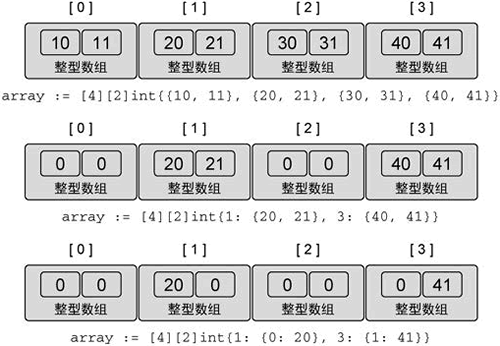

<center><h1>多维数组</h1></center>

---

在 Go 语言中数组本身只有一个维度，不过可以组合多个数组创建多维数组。多维数组很容易管理具有父子关系的数据或者与坐标系相关联的数据。

【示例 1】声明二维数组

```go
// 声明一个二维整型数组，两个维度分别存储 4 个元素和
var array [4][2]int
// 使用数组字面量来声明并初始化一个二维整型数组
array := [4][2]int{{10, 11}, {20, 21}, {30, 31}, {40, 41}}
// 声明并初始化外层数组中索引为 1 个和 3 的元素
array := [4][2]int{1: {20, 21}, 3: {40, 41}}
// 声明并初始化外层数组和内层数组的单个元素
array := [4][2]int{1: {0: 20}, 3: {1: 41}}
```

下图展示了上面示例中声明的二维数组在每次声明并初始化后包含的值。

<div align=center> 
     
    <p>图：二维数组及其外层数组和内层数组的值</p>
</div>

为了访问单个元素，需要反复组合使用[]运算符，如下所示。

【示例 2】访问二维数组的元素

```go
// 声明一个 2×2 的二维整型数组
var array [2][2]int
// 设置每个元素的整型值
array[0][0] = 10
array[0][1] = 20
array[1][0] = 30
array[1][1] = 40
```

只要类型一致，就可以将多维数组互相赋值，如下所示。多维数组的类型包括每一维度的长度以及最终存储在元素中的数据的类型。

【示例 3】同样类型的多维数组赋值

```go
// 声明两个不同的二维整型数组
var array1 [2][2]int
var array2 [2][2]int
// 为每个元素赋值
array2[0][0] = 10
array2[0][1] = 20
array2[1][0] = 30
array2[1][1] = 40
// 将 array2 的值复制给 array1
array1 = array2
```

因为每个数组都是一个值，所以可以独立复制某个维度，如下所示。

【示例 4】使用索引为多维数组赋值

```go
// 将 array1 的索引为 1 的维度复制到一个同类型的新数组里
var array3 [2]int = array1[1]
// 将外层数组的索引为 1、内层数组的索引为0 的整型值复制到新的整型变量里
var value int = array1[1][0]
```
