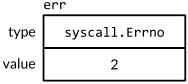

<center><h1>error接口</h1></center>

---

实际上它就是 interface 类型，这个类型有一个返回错误信息的单一方法：

```go
type error interface {
    Error() string
}
```

创建一个 error 最简单的方法就是调用 errors.New 函数，它会根据传入的错误信息返回一个新的 error。整个 errors 包仅只有 4 行：

```go
package errors
func New(text string) error { return &errorString{text} }
type errorString struct { text string }
func (e *errorString) Error() string { return e.text }
```

承载 errorString 的类型是一个结构体而非一个字符串，这是为了保护它表示的错误避免粗心（或有意）的更新。并且因为是指针类型 \*errorString 满足 error 接口而非 errorString 类型，所以每个 New 函数的调用都分配了一个独特的和其他错误不相同的实例。我们也不想要重要的 error 例如 io.EOF 和一个刚好有相同错误消息的 error 比较后相等。

```
fmt.Println(errors.New("EOF") == errors.New("EOF")) // "false"
```

调用 errors.New 函数是非常稀少的，因为有一个方便的封装函数 fmt.Errorf，它还会处理字符串格式化。

```go
package fmt
import "errors"
func Errorf(format string, args ...interface{}) error {
    return errors.New(Sprintf(format, args...))
}
```

虽然 \*errorString 可能是最简单的错误类型，但远非只有它一个。例如，syscall 包提供了 Go 语言底层系统调用 API。在多个平台上，它定义一个实现 error 接口的数字类型 Errno，并且在 Unix 平台上，Errno 的 Error 方法会从一个字符串表中查找错误消息，如下面展示的这样：

```go
package syscall
type Errno uintptr // operating system error code
var errors = [...]string{
    1: "operation not permitted", // EPERM
    2: "no such file or directory", // ENOENT
    3: "no such process", // ESRCH
    // ...
}
func (e Errno) Error() string {
    if 0 <= int(e) && int(e) < len(errors) {
        return errors[e]
    }
    return fmt.Sprintf("errno %d", e)
}
```

下面的语句创建了一个持有 Errno 值为 2 的接口值，表示 POSIX ENOENT 状况：

```
var err error = syscall.Errno(2)
fmt.Println(err.Error()) // "没有这样的文件或目录"
fmt.Println(err) // "没有这样的文件或目录"
```

err 的值图形化如下图所示。



Errno 是一个系统调用错误的高效表示方式，它通过一个有限的集合进行描述，并且它满足标准的错误接口。
